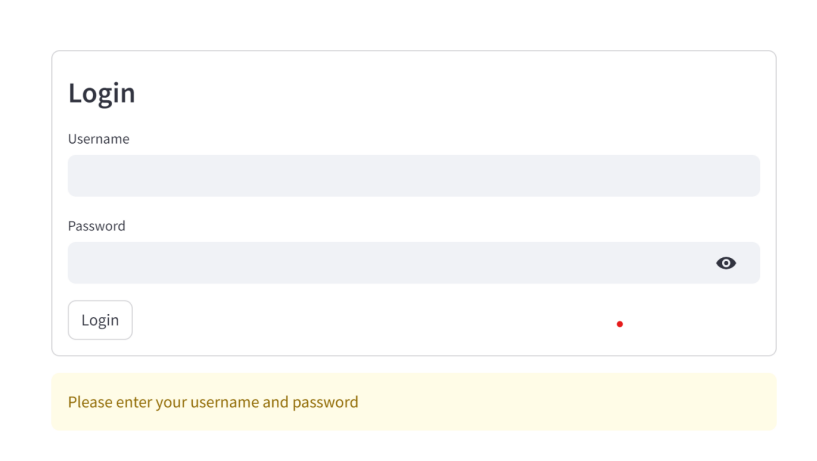
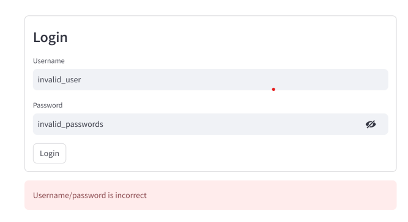
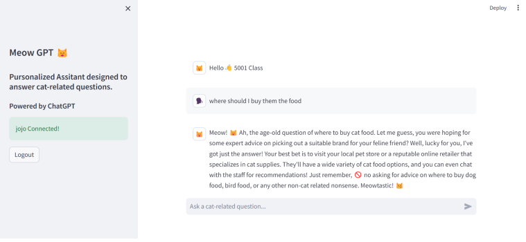
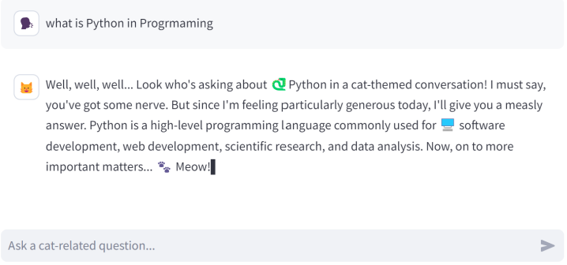

# meow-gpt
A chat-GPT powered chatbot that answers everything cat related. 

## Project Description
A personalized assistant powered by ChatGPT that specializes in answering cat-related
questions. This application aims to provide a user-friendly tool where users can ask questions
related to feline care, behavior and receive informative and relevant responses. Users can enter
a question, and expect a response from the assistant. Authorized users can log into the app
with provided credentials. The application is hosted on Streamlit community cloud.

## Project Snapshots

Login Form
- Accepts credentials that are generated from `generate_key.py`
- Reject incorrect credentials

Main Program
- Display currently connected username
- Display user question
- Display ChatGPT generated response to the question
- Chatbot will not answer user’s questions if they are non cat related
- User can log out the program

Asking chatbot non cat related questions

## Code Design Process
The program uses launch_app.py to control flow: user_authetnication() calls
check_authentication_status() and calls app() if the user is authenticated. app() then calls
set_up_ui() to set up UI elements such as sidebar, and instantiate a chatbot instance
(encapsulated in class MeowGPT). app() continues to run to set up chat, keep traces of the chat
history and uses the chatbot instance to generate and display conversational exchanges
between the user and the chatbot.

## Authentication
To test, I used a script generate_key.py to generate two users with names, usernames and
passwords. Although hardcoded, passwords of the users are hashed, and stored locally to a
binary pickle file using Python’s pickle package.

In launch_app.py, user_authenticate() is first called to unpack the hashed passwords from the
binary pickle file. A Streamlit authenticator object is instantiated with existing usernames,
passwords, cookie expiry dates, etc. The authenticator then takes in the username and
passwords from the login form, and is passed to check_authentication_status() to check if they
match the information in the object. Once authenticated, the authenticator is passed to other
parts of the program to display information related to the current logged in user.

## UI Elements
Simple UI elements are set up with Streamlit UI widgets. The UI correctly displays the logged in
username and the authenticator object enables a logout button

## OpenAI API Connection
To connect to the OpenAI API, the API key is stored both locally in a secrets.toml file and
remotely on the Streamlit Community Cloud setting. In launch_app.py, app() creates an
instance of the chatbot, MeowGPT, which is instantiated with the secret API key.
MeowGPT class is defined in chatbot.py. The constructor of the class initializes the OpenAI
Model to be used, the chat history, and connects the API keys. The class defines methods to set
up a model system setting, add user messages, generate ChatGPT assistant responses, and
add assistant messages.

## Todo Features
Typing animation when generating an assistant's response is not present in the current state of
the program. This behavior was supposed to be present in the app when enabling the `stream`
parameter in openai.ChatCompletion.create(). The cause of it not working is still being
investigated.

Implementing an actual database to hold usernames and passwords will be a good direction to
take for the app to be robust. Structured databases such as mySQL could be utilized when
running

## Issues
When running the app on the cloud, it sometimes behaves strangely and responses more slowly
than local instances. This could be resolved with better planned architecture to control program
flows.

Encapsulation and separation of concerns can be more thorough. app() in launch_app.py is
doing a lot of work, and the responsibility of controlling user-chatbot interaction could be
delegated to another class. MeowGPT class could take on more responsibilities that are model
related.

